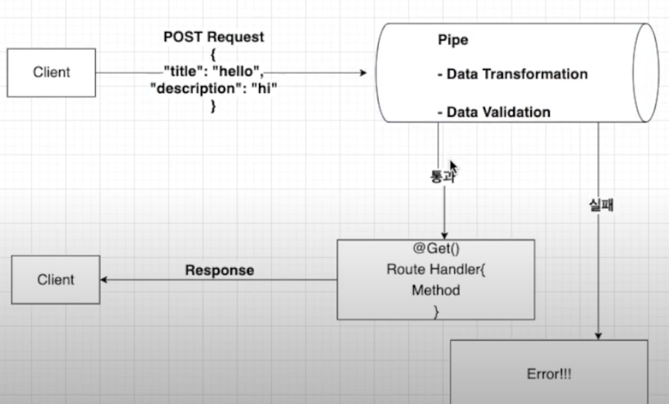

<p align="center">
  <a href="http://nestjs.com/" target="blank"></a>
</p>

[circleci-image]: https://img.shields.io/circleci/build/github/nestjs/nest/master?token=abc123def456
[circleci-url]: https://circleci.com/gh/nestjs/nest

  <p align="center">A progressive <a href="http://nodejs.org" target="_blank">Node.js</a> framework for building efficient and scalable server-side applications.</p>
    <p align="center">
<a href="https://www.npmjs.com/~nestjscore" target="_blank"></a>
<a href="https://www.npmjs.com/~nestjscore" target="_blank"></a>
<a href="https://www.npmjs.com/~nestjscore" target="_blank"></a>
<a href="https://circleci.com/gh/nestjs/nest" target="_blank"></a>
<a href="https://coveralls.io/github/nestjs/nest?branch=master" target="_blank"></a>
<a href="https://discord.gg/G7Qnnhy" target="_blank"></a>
<a href="https://opencollective.com/nest#backer" target="_blank"></a>
<a href="https://opencollective.com/nest#sponsor" target="_blank"></a>
  <a href="https://paypal.me/kamilmysliwiec" target="_blank"></a>
    <a href="https://opencollective.com/nest#sponsor"  target="_blank"></a>
  <a href="https://twitter.com/nestframework" target="_blank"></a>
</p>
  <!--[](https://opencollective.com/nest#backer)
  [](https://opencollective.com/nest#sponsor)-->

## Description

[Nest](https://github.com/nestjs/nest) framework TypeScript starter repository.

## Installation

```bash
$ npm install
```

## Running the app

```bash
# development
$ npm run start

# watch mode
$ npm run start:dev

# production mode
$ npm run start:prod
```

## Test

```bash
# unit tests
$ npm run test

# e2e tests
$ npm run test:e2e

# test coverage
$ npm run test:cov
```

## 설명

### 파일구조 ###

1. eslintrc.js
 - 개발자들이 특정한 규칙을 가지고 코드를 짤 수 있도록 도와주는 라이브러리
 - 타입스크립트 쓰는 가이드라인을 제시
 - 문법에 오류나면 알려주는 역할 등등..

2. prettierrc
- 주로 코드 형식을 맞추는데 사용 (작은 따옴표를 쓸지, 큰 따옴표를 쓸지 등등)

3. nest-cli.json
- nest 관련 설정
- soureRoot 를 src로 설정해주는 등

4. package.json
- 패키지의 이름, 버전, 빌드방식, 라이브러리 버전 등 패키지 정보

5. src 폴더
- 로직들이 들어가있음
- **main.ts**가 어플리케이션 생성을 하고, 루트모듈인 AppModule을 생성한다. 3000번 포트에서 앱을 실행한다.


### 모듈생성 ###
```
nest g module boards
``` 
- nest: using nestcli
- g: generate
- module: chematic that i want to create
- boards: name of the schematic


### Controler ###
- 데코레이터를 통해 컨트롤러를 정의할 수 있다.
- Handler(@Get, @Post, @Put)를 정의할 수 있다.
- nest cli 사용해서 컨트롤러 생성 가능하다.
```
nest g controller boards --no-spec
```
- --no-spec: 테스트 코드 없이
- 실행순서
  - cli는 먼저 boards 폴더를 찾는다
  - controller 파일 생성
  - boards 폴더 안에 module 폴더를 찾는다
  - module 폴더 안에 controller 추가(등록)
- requesBody 선언 - Body 데코레이터 이용
  ``` typescript
  @Post()
  create(
    @Body('title') title,
    @Body('description') description){
      return this.boardsService.create(title, description);
    }
  )
  ```
- 경로변수는 다음과 같이 받을 수 있다. (localhost:5000?id=~~)
  ``` typescript
      @Get('/:id')
      find(@Param('id') id: string): Board{
          return this.boardsService.findById(id);
      }
  ```
- 경로변수가 여러개라면 다음과 같이 작성 가능하다.
  ``` typescript
      find(@Param() params: stiring[])
  ```
### Service ###
```
nest g service boards --no-spec
```
- boards.service.ts 생성
``` typescript
  @Injectable()
  export class AppService{
    getHello(): string {
      return 'Hello World!';
    }
  }
```

- @Injectable() 데코레이터가 있어서, 다른 컴포넌트에서 이 Service를 사용할 수 있게 된다
- boards 모듈, 컨트롤러에 추가된다
- boards 컨트롤러에서 사용 가능하도록 컨트롤러 constructor를 통해 주입해준다.
  ``` typescript
  @Controller('boards')
  export class BoardsController {
      boardsService: BoardsService;

      constructor(boardsService: BoardsService) {
        this.boardsServie = boardsService;
      }
  }

  // 간단하게 다음과 같이 작성가능(타입스크립트 기능, private을 써주면 인수인 파라미터가 암묵적으로 프로퍼티로 선언됨, private인 이유는 이 클래스 안에서만 사용하기 위해서)
  constructor(private boardsService: BoardsService){}
  ```

### Provider ###
: Nest의 기본 개념으로, 기본 Nest 클래스는 서비스, 리포지토리, 팩터리, 헬퍼 등 프로바이더로 취급될 수 있습니다. 주요 아이디어는 **종속성으로 주입**할 수 있다는 것으로, 객체는 서로 다양한 관계를 가지고, 인스턴스들간의 연결하는 기능은 Nest 런타임 시스템에 위임됩니다.

- 등록 방식
  : module 파일에서 등록을 통해 해당 모듈에서 사용하고자 하는 Provider를 입력해줄 수 있다.
  ``` typescript
  @Module({
    controller: [BoardsController],
    providers: [BoardsService]
  })
  ```

### 인터페이스 선언 ###
: 인터페이스는 타입만을 체크하고, 클래스는 타입뿐 아니라 인스턴스 생성이 가능
``` typescript
export interface Board {
  id: string;
  title: string;
  description: string;
  status BoardStatus;
}
```
### Enum 선언 ###
``` typescript
export enum BoardStatus {
  PUBLIC = 'PUBLIC',
  PRIVATE = 'PRIVATE'
}
```

### Dto 생성 ###
- 클래스 형태로 생성한다.
``` typescript
export class CreateBoardDto{
    title: string;
    description: string;
}
```

### Pipe에 대해서 ###
- Pipe는 @Injectable() 데코레이터로 주석이 달린 클래스
- Data Transformation, Data Validation에 사용
  - 여기서 실패하면 에러발생
  - **Data Transformation**
    - 입력 데이터를 원하는 형식으로 변환, 변환 실패 시 에러발생 ('7' -> 7)
  - **Data Validation**
    - 유효성 검사 (10자 이내인데 이상값 들어오면 에러)
- Nest는 메서드가 호출되기 전에 파이프를 삽입하고, 파이프는 메서드를 향하는 인수를 수신하고 작동
  
- **사용방법**
  1. Handler-level Pipes
     ``` typescript
     // 이 핸들러에만 파이프가 작동
     @Post()
     @UsePipes(pipe)
     createBoard(){}
     ```
  2. Parameter-level Pipes
     ``` typescript
     @Post()
     create(
      @Body('title', ParameterPipe) title, // 파이프 적용
      @Body('description') description)    // 파이프 미적용
     {}
     ```
  3. Global-level Pipes
     - 어플리케이션 레벨의 파이프
     - 클라이언트에서 들어오는 모든 요청에 적용
     ``` typescript
     async function bootstrap() {
     const app = await NestFactory.create(AppModule);
     app.useGlobalPipes(GlobalPipes);
     await app.listen(3000);
     }
     bootstrap();
     ```
  4. Nest가 제공하는 6가지 파이프 존재
    - ValidationPipe
    - ParseIntPipe
    - ParseBoolPipe
    - ParseArrayPipe
    - ParseUUIDPipe
    - DefaultValuePipe
    ``` typescript
    @Get(':id')
    findOne(@Param('id', ParseIntPipe) id: number)  // 문자열로 받으면 에러발생, number로 변환, 유효성 검사
    {return;}
    ```
  5. Custom Pipe
  ``` typescript
  export class ---Pipe implements PripeTrasform {
    transform(value: any, metaData: ArgumentMetadata) {}
  }
  ```

### 타입스크립트에 대해서 ###
``` typescript
const board = {
  title: title
}

// 다음 코드로 치환가능

const board = {
  title
}
```

<br>

``` typescript
const title = createBoardDto.title;
const description = createBoardDto.description;

// 다음 코드로 치환가능

const {title, description} = createBoardDto;
```

<br>

- 접두사(prefix) readOnly는 읽기전용이다. 외부에서 접근 가능하지만 값은 변경할 수 없다.

<br>

- 클래스는 인터페이스와 다르게 런타임에서 작동한다.